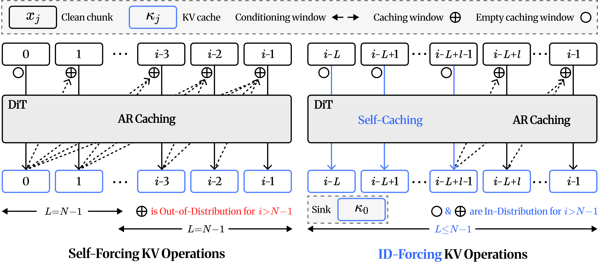

<p align="center">
<h1 align="center">ID-Forcing</h1>
<h3 align="center">In-Distribution Forcing for Long Video Generation at Test Time</h3>
</p>
<p align="center">
  <p align="center">
    <a href="">Jeongwoo Shin</a><sup>1*</sup>
    ·
    <a href="">Youngyoon Choi</a><sup>1*</sup>
    ·
    <a href="">Sangwoo Jo</a><sup>2</sup>
    ·
    <a href="">Hyunmog Kim</a><sup>3</sup><br>
    <a href="">Sungjoon Choi</a><sup>2†</sup>
    ·
    <a href="">Joonseok Lee</a><sup>1†</sup>
    ·
    <a href="">Jaewoong Choi</a><sup>4†</sup>
    ·
    <a href="">Jaemoo Choi</a><sup>5†</sup><br>
    <sup>1</sup>Seoul National University <sup>2</sup>Korea University <sup>3</sup>Arontier Co., Ltd. <sup>4</sup>Sungkyunkwan University <sup>5</sup>Georgia Institute of Technology<br>
    <sup>*</sup>Equal contribution · <sup>†</sup>Corresponding author
  </p>
  <h3 align="center"><a href="">Paper</a> | <a href="">Website</a></h3>
</p>

---

## 💡 TL;DR

Autoregressive video diffusion models drift once they roll out past their training horizon: colors
and textures shift and motion dies down. Prior work controls which cached KV entries the model
reads, but assumes those entries are in-distribution. They are not. A KV entry also depends on the
entries it attended to when it was cached (its *provenance*), and beyond the horizon every chunk is
cached under a provenance never seen in training. We call this the **KV-provenance problem**.
**ID-Forcing** is a training-free, test-time framework that keeps both KV caching and KV
conditioning in-distribution. **Self-caching** computes each chunk's KV while it attends only to
itself, which prevents out-of-distribution entries at their source. An **exact rolling window**
keeps the first chunk together with the most recent entries at trained positions. With this,
short-horizon models (Self-Forcing, LongLive) extend to minute-scale videos with substantially
less drift.



## TABLE OF CONTENTS
1. [Highlights](#-highlights)
2. [Supported Base Models](#-supported-base-models)
3. [Requirements](#-requirements)
4. [Installation](#-installation)
5. [Quick Start](#-quick-start)
6. [Method Overview](#-method-overview)
7. [Drift Metrics](#-drift-metrics)
8. [Repository Layout](#-repository-layout)
9. [Acknowledgements](#-acknowledgements)
10. [Citation](#-citation)
11. [License](#-license)

## ✨ Highlights

- **Self-Caching**: a chunk's KV is computed while the chunk attends only to itself. Cached entries
  therefore have no out-of-distribution provenance.
- **Exact Rolling Window**: the first chunk (the sink) and the most recent entries are kept, with
  their RoPE re-rotated onto trained positions. Every chunk attends to a fixed 12-frame window,
  however long the video runs.
- **Training-Free**: runs on the released Self-Forcing and LongLive checkpoints. Their weights and
  model code are unchanged; only what the KV cache holds is decided differently.
- **Drift Metrics Included**: scripts for the color-shift and motion-drift metrics we report.

## 🤖 Supported Base Models

| Base Model | Checkpoint | LoRA | Weights | ID-Forcing takes over at |
|---|---|---|---|---|
| [Self-Forcing](https://github.com/guandeh17/Self-Forcing) | `self_forcing_dmd.pt` | — | EMA (`generator_ema`) | chunk 7, after the 21-frame training horizon |
| [LongLive](https://github.com/NVlabs/LongLive) | `longlive_base.pt` + `lora.pt` | ✅ | `generator` | chunk 1, with self-caching only |

## 💻 Requirements

- One NVIDIA GPU with 40 GB+ VRAM (tested on A100 40 GB)
- Python 3.10, PyTorch ≥ 2.4 (tested with 2.5 and 2.6), flash-attn
- For motion drift only: a separate environment with VBench (see [Drift Metrics](#-drift-metrics))

## 📦 Installation

```bash
conda create -n idforcing python=3.10 -y
conda activate idforcing
pip install -r requirements.txt
pip install flash-attn --no-build-isolation
```

## 🚀 Quick Start

### 1. Download Checkpoints

Download the weights into the repository root:

```bash
# Wan2.1 base model (text encoder, VAE, config): used by both
huggingface-cli download Wan-AI/Wan2.1-T2V-1.3B --local-dir wan_models/Wan2.1-T2V-1.3B

# Self-Forcing (DMD); ID-Forcing uses its EMA weights (`generator_ema`)
huggingface-cli download gdhe17/Self-Forcing checkpoints/self_forcing_dmd.pt --local-dir .

# LongLive-1.3B: base model + LoRA
huggingface-cli download Efficient-Large-Model/LongLive-1.3B --include "models/*" --local-dir checkpoints/longlive
```

| Model | Source | Files |
|---|---|---|
| Self-Forcing | [gdhe17/Self-Forcing](https://huggingface.co/gdhe17/Self-Forcing/blob/main/checkpoints/self_forcing_dmd.pt) | `checkpoints/self_forcing_dmd.pt` (EMA weights used) |
| LongLive | [Efficient-Large-Model/LongLive-1.3B](https://huggingface.co/Efficient-Large-Model/LongLive-1.3B) | `models/longlive_base.pt`, `models/lora.pt` |
| Wan2.1 | [Wan-AI/Wan2.1-T2V-1.3B](https://huggingface.co/Wan-AI/Wan2.1-T2V-1.3B) | text encoder, VAE, config |

Expected layout:

```
wan_models/Wan2.1-T2V-1.3B/
checkpoints/self_forcing_dmd.pt
checkpoints/longlive/models/longlive_base.pt
checkpoints/longlive/models/lora.pt
```

### 2. Run Inference

Both scripts make 2-minute videos by default. Pass a single prompt with `PROMPT`, or a file with
one prompt per line with `PROMPT_FILE`.

**With Self-Forcing:**
```bash
PROMPT="A white and orange tabby cat happily darts through a dense garden ..." bash run_self_forcing.sh
```

**With LongLive:**
```bash
PROMPT="A white and orange tabby cat happily darts through a dense garden ..." bash run_longlive.sh
```

**Many prompts on several GPUs, or a longer video:**
```bash
PROMPT_FILE=prompts/moviegenbench_128.txt GPUS=0,1,2,3 bash run_longlive.sh
DURATION=240 SEED=333 OUTPUT=outputs/sf_240s bash run_self_forcing.sh
```

Options are environment variables:

| Variable | Default | Meaning |
|---|---|---|
| `PROMPT` | – | a single prompt; overrides `PROMPT_FILE` |
| `PROMPT_FILE` | – | one prompt per line |
| `DURATION` | `120` | video length in seconds (120 s = 160 chunks = 1917 frames) |
| `SEED` | `1356145` | random seed |
| `GPUS` | `$CUDA_VISIBLE_DEVICES`, else `0` | comma-separated GPU ids; prompts are split across them, one process per GPU |
| `OUTPUT` | `outputs/self_forcing`, `outputs/longlive` | output folder |
| `PYTHON` | `python` | interpreter |
| `CKPT` | `checkpoints/self_forcing_dmd.pt` | Self-Forcing checkpoint (`run_self_forcing.sh`) |
| `GEN_CKPT`, `LORA_CKPT` | `checkpoints/longlive/models/{longlive_base,lora}.pt` | LongLive checkpoints (`run_longlive.sh`) |

The Python entry points can also be called directly; `--help` lists every option:

```bash
python self_forcing/idforcing.py --prompt "..." --seconds 120 --seed 1356145
python longlive/idforcing.py --prompt_file prompts/moviegenbench_128.txt --seconds 240
```

Each video is saved as `<output>/<first 100 characters of the prompt>-<seed>-0.mp4` at 16 fps.
Videos that already exist are skipped, so you can restart an interrupted run with the same command.

> [!NOTE]
> A 2-minute video takes about 6 minutes on one A100, including VAE decoding. Noise is drawn
> exactly as in our experiments, and run side by side with our experiment code on the same GPU,
> the scripts compute the same videos. On the same machine and software, the Self-Forcing script
> is bit-for-bit repeatable. LongLive's pipeline is not: its outputs vary slightly from run to run,
> with our experiment code as well. Across different GPUs, drivers or library versions, expect
> visually identical rather than bit-identical videos.

## 🔬 Method Overview

Both models generate chunks of 3 latent frames (12 video frames, 0.75 s at 16 fps). A
*self-cached* entry is a chunk's KV computed by a clean forward pass in which the chunk attends to
itself only. Cached entries move from slot to slot by rotating the temporal RoPE of their keys.
The window's positions therefore never grow with the video.

**Self-Forcing.** Chunks 0–6 (21 latent frames, the length Self-Forcing is trained on) come from
Self-Forcing's own rollout. From chunk 7 on, chunk *n* attends to:

```
[ Sink ] + [ chunk n-2, self-cached ] + [ chunk n-1, AR on chunk n-2 ] + [ chunk n ]
 RoPE 0-2          RoPE 3-5                      RoPE 6-8                  RoPE 9-11
```

| Block | Content |
|---|---|
| **Sink** | chunk 0's KV, as Self-Forcing cached it (chunk 0 attends to itself only) |
| **Self-cached** | chunk *n*−2, cached attending only to itself |
| **AR** | chunk *n*−1, re-encoded attending to chunk *n*−2's self-cached KV; rebuilt for every chunk and never stored |
| **Current** | chunk *n*, being denoised; self-cached at frames 9–11 afterwards |

**LongLive.** ID-Forcing takes over from the first chunk, with self-caching only. Chunk 0 is
LongLive's own first chunk and becomes the sink. Chunk 1 attends to `sink | self`, chunk 2 to
`sink | chunk 1 | self`, and every chunk *n* ≥ 3 to:

```
[ Sink ] + [ chunk n-2, self-cached ] + [ chunk n-1, self-cached ] + [ chunk n ]
 RoPE 0-2          RoPE 3-5                     RoPE 6-8                RoPE 9-11
```

## 📏 Drift Metrics

`eval/` measures how far a long video drifts away from its opening, on any folder of `.mp4` files.

| Metric | Script | What it measures | Report |
|---|---|---|---|
| **Color shift** | `eval/color_shift.py` (CPU) | L1 distance (0–2) and Pearson correlation between the 180-bin HSV-hue histograms of the first and the last frame | ColorShift = 100 · (1 − mean L1 / 2), higher is better |
| **Motion drift** | `eval/motion_drift.py` (GPU) | VBench's dynamic-degree test (RAFT optical flow, frames subsampled to 8 fps) on the first and on the last 5 seconds | LOST = % of videos moving at the start but static at the end; LOST_score = 100 − LOST, higher is better |

Motion drift needs VBench's `DynamicDegree` and the RAFT weights it downloads. Install them in an
environment of their own: VBench pins older packages, and we used Python 3.8 with torch 2.4.1.

```bash
pip install vbench==0.1.5 easydict opencv-python
mkdir -p ~/.cache/vbench/raft_model
wget -P ~/.cache/vbench/raft_model https://dl.dropboxusercontent.com/s/4j4z58wuv8o0mfz/models.zip
unzip -d ~/.cache/vbench/raft_model ~/.cache/vbench/raft_model/models.zip   # -> models/raft-things.pth
```

Run both metrics on a folder of videos (`PYTHON` is the interpreter of that environment):

```bash
PYTHON=/path/to/vbench_env/bin/python bash eval/run_drift.sh outputs/self_forcing
PYTHON=... GPUS=0,1,2,3 bash eval/run_drift.sh outputs/longlive          # motion drift on 4 GPUs
PYTHON=... END=1917 bash eval/run_drift.sh outputs/sf_240s               # score 4 min clips at 2 min
```

The per-video results go to `<folder>_color_shift.csv` and `<folder>_motion_drift.csv`, and the
summary is printed. Each script also runs on its own; see `--help`.

## 📂 Repository Layout

```
run_self_forcing.sh, run_longlive.sh     entry scripts
self_forcing/idforcing.py                ID-Forcing rollout on Self-Forcing
self_forcing/configs/                    Self-Forcing inference config
self_forcing/{pipeline,utils,wan,demo_utils}/
longlive/idforcing.py                    ID-Forcing rollout on LongLive
longlive/configs/                        LongLive inference config (incl. LoRA settings)
longlive/{pipeline,utils,wan}/
eval/                                    drift metrics (color_shift.py, motion_drift.py, run_drift.sh)
prompts/moviegenbench_128.txt            the 128 evaluation prompts
```

`self_forcing/` and `longlive/` contain only the files of the original repositories that inference
imports: Self-Forcing at commit `33593df` and LongLive at commit `e52d9ef`. These files are
unmodified. The only changes are to package `__init__.py` files: some were reduced to the modules
that are shipped, and empty ones were added to `utils/` and `demo_utils/`.

## 🙏 Acknowledgements

This project builds upon the following works:

- [**Self-Forcing**](https://github.com/guandeh17/Self-Forcing): autoregressive video diffusion with self-forcing training
- [**LongLive**](https://github.com/NVlabs/LongLive): real-time interactive long video generation
- [**Wan2.1**](https://github.com/Wan-Video/Wan2.1): base video diffusion model
- [**Deep Forcing**](https://github.com/cvlab-kaist/DeepForcing): the KV rotation in `self_forcing/idforcing.py` follows its `_rope_time_delta_mul_`
- [**MemRoPE**](https://github.com/YoungRaeKimm/MemRoPE) and [**MovieGenBench**](https://ai.meta.com/research/movie-gen/): the 128 evaluation prompts are MemRoPE's refined MovieGenBench subset
- [**VBench**](https://github.com/Vchitect/VBench): dynamic-degree test used by the motion-drift metric

## 📄 Citation

If you find this work useful, please consider citing:

```bibtex
@article{idforcing2026,
  title   = {In-Distribution Forcing for Long Video Generation at Test Time},
  author  = {Shin, Jeongwoo and Choi, Youngyoon and Jo, Sangwoo and Kim, Hyunmog and Choi, Sungjoon and Lee, Joonseok and Choi, Jaewoong and Choi, Jaemoo},
  journal = {arXiv preprint arXiv:0000.00000},
  year    = {2026}
}
```

## 📝 License

The code taken from Self-Forcing and LongLive keeps its original Apache License 2.0
(`self_forcing/LICENSE`, `longlive/LICENSE`).
